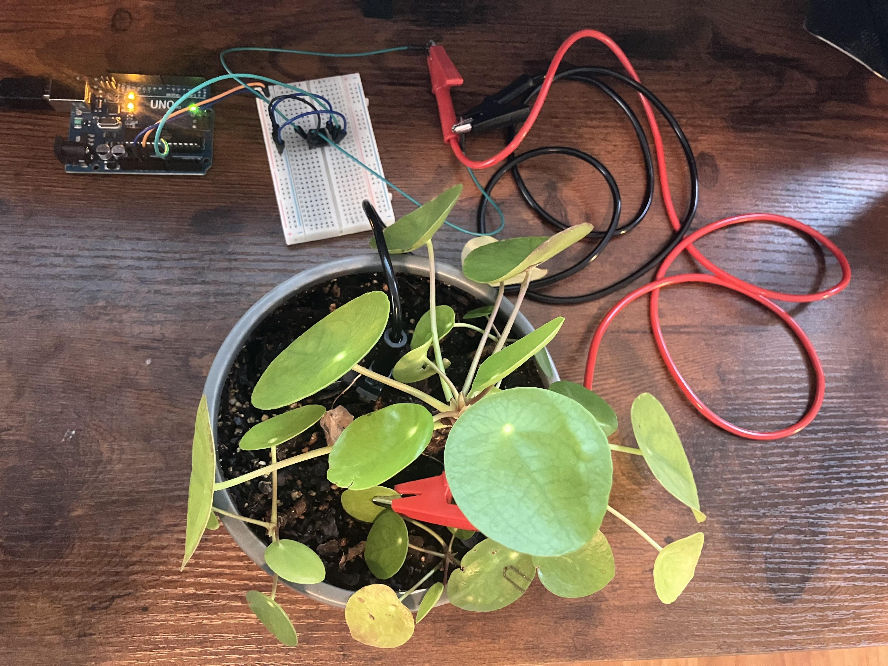

# organic-music

Plants are very much alive, and can be understood in many different ways, one of those ways is sound. Plants' production of these electrical signals is complex an an active field of study. One of the leading explanations for these signals is Action Potentials, these are when the plants vascular system (phloem) reacts to various stimuli around the plant, an example many folks may recognize is a Venus flytrap closing on an insect. 
 
This project listens to those signals and turns them into sound. While this can be a new and cool way to look at plants, it's worth considering that this is massively a human driven project. This is valuable to consider as it's a great reminder that our perception and understanding of the natural world is significantly limited by the tools we use to analyze it and our own sensory restraints. 
 
`organic-music` is an open source instrument built from an Arduino, a handful of components, and a houseplant. Alligator clips sit in the soil and on a leaf. An instrumentation amplifier catches the tiny voltage difference between them. 
 
This is not meant to be an out of the box solution in its entirety, the main purpose of this is to DIY yourself but have some of the techn/math already sorted out for you so you can focus on learning those concepts. 

Everything here is documented so you can build it yourself; the circuit, the code, the reasoning behind the design choices. No background in electronics required, just curiosity.
 
Recordings are saved as `.wav` files to `./samples` and can be shared anywhere audio files work.

**[Listen to What The Below Set up Produced!](https://soundcloud.com/emanuel_eagle/plant_20260420_180437?si=6f64b3dae1e84f518d785bc9c3c4dd78&utm_source=clipboard&utm_medium=text&utm_campaign=social_sharing)**



---

## How it works

A pair of electrodes (alligator clips) sit in the soil and on a leaf of a houseplant. The voltage difference between them (tiny, on the order of millivolts) is picked up by an INA128PA instrumentation amplifier and passed to an Arduino Uno, which reads it on an analog pin and streams values over USB to a Mac.

A Python script reads that stream, smooths it with a rolling average, and maps it into the Mandelbrot set: the voltage controls the imaginary part of the complex number C, while the real part is fixed at a point on the boundary of the set. The number of iterations before the sequence escapes determines a normalized 0–1 value, which maps to a frequency between 200 and 2000 Hz.

That frequency feeds a continuous audio stream playing through whatever output device you have connected. The tone never stops — it just slowly shifts.

---

## Hardware

- Arduino Uno
- INA128PA instrumentation amplifier (DIP-8)
- Breadboard
- 2x alligator clip leads
- Jumper wires
- A resistor between ~50–500 ohms (for amplifier gain — see below)
- A houseplant

### Wiring

The INA128PA sits straddled across the center of the breadboard. With pin 1 at e11:

```
Pin 1 (RG)   → e11   (one leg of gain resistor)
Pin 2 (IN−)  → e12   (black alligator clip, soil)
Pin 3 (IN+)  → e13   (red alligator clip, leaf)
Pin 4 (V−)   → e14   (jumper to negative rail, GND)
Pin 5 (REF)  → f14   (jumper to negative rail, GND)
Pin 6 (OUT)  → f13   (jumper to Arduino A0)
Pin 7 (V+)   → f12   (jumper to positive rail, 5V)
Pin 8 (RG)   → f11   (other leg of gain resistor)
```

Positive rail → Arduino 5V  
Negative rail → Arduino GND

### Setting the gain

The resistor between pins 1 and 8 sets how much the amp multiplies the plant signal. The formula is:

**Gain = 1 + (50,000 / resistor in ohms)**

A 470 ohm resistor gives about 100x gain, which is a good starting point. Too little gain and the signal is too weak to be interesting. Too much and it clips or saturates.

### Electrodes

- Red clip → somewhere on a leaf
- Black clip → into the soil near the roots

Keep the wires short. Move the breadboard away from your computer if you pick up a strong 60 Hz sawtooth pattern - that is mains electrical noise from the wall outlets, not the plant.

---

## Software setup

You'll need Python (via Homebrew works fine) and the Arduino IDE or VSCode with the Arduino extension.

### Python dependencies

```
pyserial
numpy
sounddevice
soundfile
```

Install with:

```bash
pip install -r requirements.txt
```

### Configuration

Open `src/main.py` and set your serial port:

```python
SERIAL_PORT = "/dev/cu.usbmodem113401"  # replace with your port
```

You can also tune these to taste:

```python
WINDOW_SIZE = 50       # higher = slower, smoother frequency changes
REAL_PART = -1.25      # fixed real part of C in the Mandelbrot set
SIGNAL_MIN = 0         # expected minimum analog reading
SIGNAL_MAX = 54        # expected maximum analog reading
```

---

## Running it

```bash
python3 src/main.py
```

The script will warm up silently for a moment while it fills the signal window, then the tone will begin. Let it run as long as you like, the plant will do what it does.

Press `Ctrl+C` to stop. You'll be asked if you want to save the session as a `.wav` file. If you say yes, it gets written to `./samples/plant_TIMESTAMP.wav`.

---

## Project structure

```
organic-music/
├── src/
│   ├── main.py
│   └── tools/
│       ├── SerialRead.py
│       ├── Mandelbrot.py
│       ├── Sound.py
│       ├── AudioSaver.py
│       └── Logger.py
├── samples/
└── requirements.txt
```

### main.py

The entry point. Wires all the tools together and runs the main loop: read a value from the plant, smooth it, transform it, play it. On `Ctrl+C` it stops cleanly and optionally saves the session.

### tools/SerialRead.py

Opens the serial connection to the Arduino and reads one line at a time. Each raw reading gets added to a rolling window (a `deque`), and the smoothed value is just the average of whatever is in that window. The window size controls how reactive the tone is to signal changes — larger means slower, more gradual shifts.

### tools/Mandelbrot.py

Takes the smoothed electrical reading and runs it through the Mandelbrot set to produce a 0–1 output value.

The signal is first mapped to the imaginary axis of a complex number C. The real part of C is fixed (defaulting to `-1.25`, a point near the boundary of the set). The code then iterates `z = z² + c` up to a maximum number of times, counting how many iterations it takes for `z` to escape. That count, divided by the maximum, becomes the normalized output.

Points near the boundary produce wildly varying iteration counts for tiny changes in the imaginary part — which is what makes this mapping musically interesting. This is the transformation most worth experimenting with.

### tools/Sound.py

Maintains a continuous sine wave audio stream using `sounddevice`. A background callback runs at 44100 Hz and generates samples for whatever the current frequency is. Frequency updates are thread-safe. The stream captures all output frames in memory when recording is active, so the full session is available to save at the end.

### tools/AudioSaver.py

Receives the recorded audio buffer and writes it as a timestamped `.wav` file to `./samples/` using `soundfile`.

### tools/Logger.py

A thin wrapper around Python's standard `logging` module. Logs each cycle's raw electrical reading and normalized value to the console so you can watch the signal in real time.

---

## Notes

The signal you're reading is real but noisy. Environmental electrical interference from nearby computers and power cables will show up — a perfectly regular sawtooth wave at 60 Hz is mains noise, not the plant. The rolling average in `SerialRead` smooths most of this out, but moving the setup away from other electronics helps.

The Mandelbrot boundary at `REAL_PART = -1.25` produces wildly varying iteration counts for small changes in the imaginary axis, which is what makes the mapping interesting. Points deep inside the set always return the maximum iteration count (no variation), and points far outside escape immediately (also no variation). The interesting music lives on the edge.


## Next Steps

I have a personal website, my goal is to eventually weatherize the Arduino set up to start recording more plants (outside for better readings), write more transformations, and then have a page on my website where people can mix and match transformations and plants on the fly. 

Specifically for more transformations, I want to be thoughtful about what is used. While all sorts of equations/formulae can convert electrical signals to sound I want the transformation to be intentional. For example with the Mandlebrot set, there are many fractals out in nature, it felt valuable and honoring of nature to include an equation found in nature, to convert electrical signals for human consumption. People are welcome to fork this repo, make their own but that's just how this repo will be developed by me. 